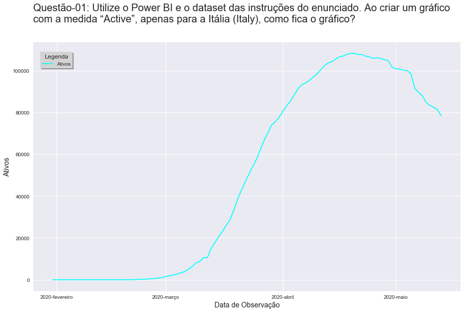
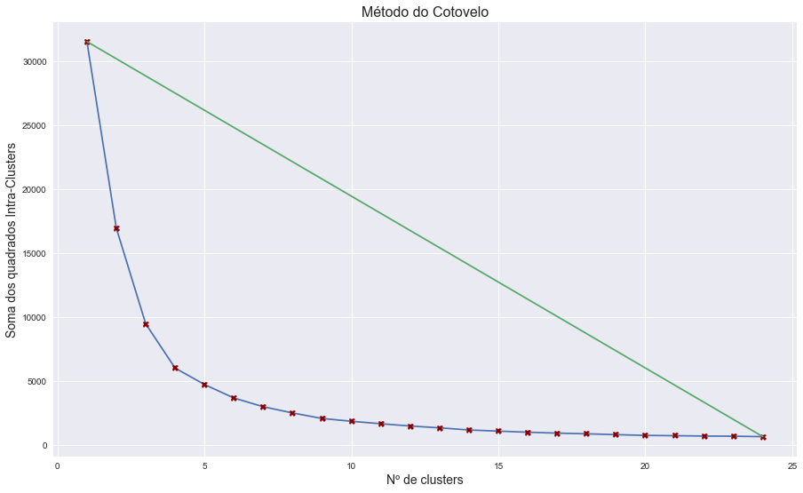
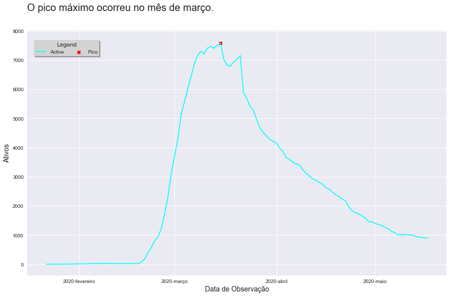
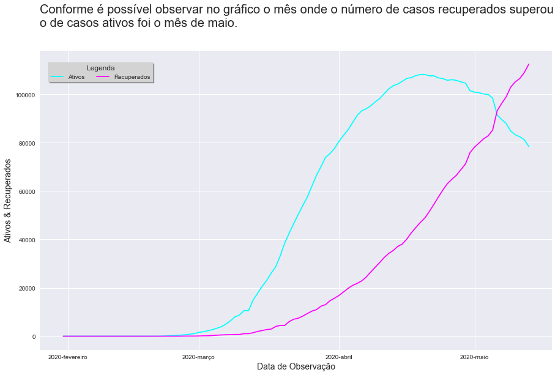
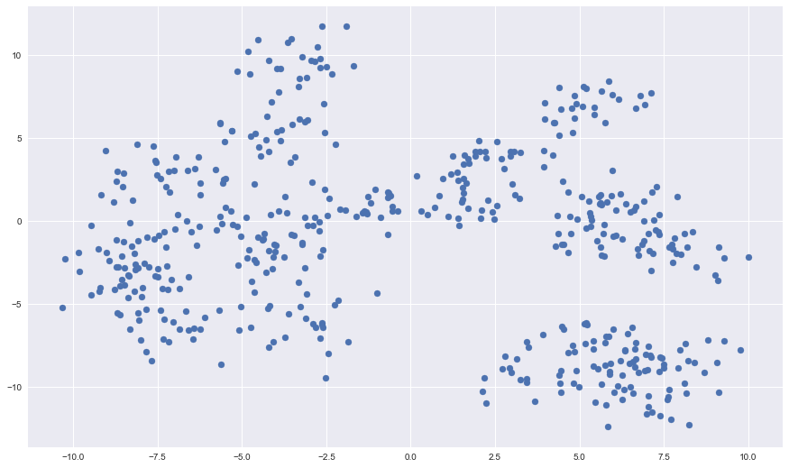
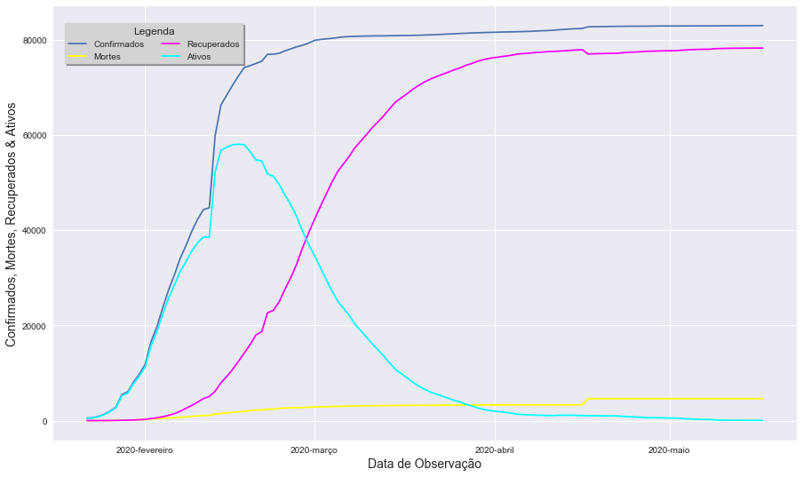
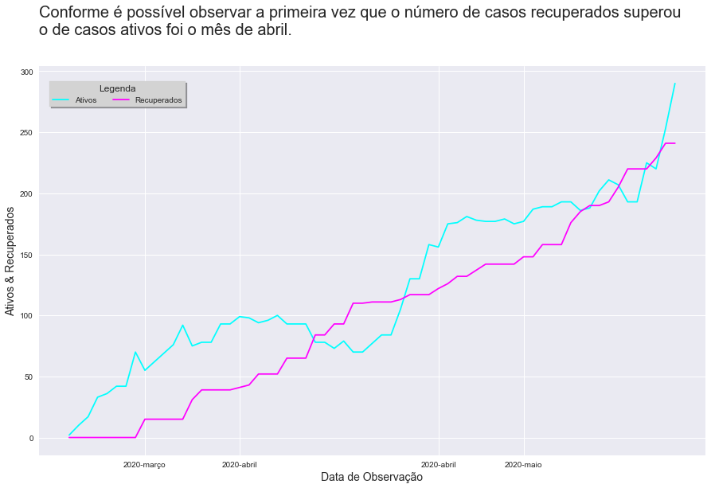

# Modulo 1  

## Conteúdo abordado
- Big data, Machine learning e Data mining
- Data analytics, Data science e Business intelligence 
- Algoritmo K-Means
- Processos e Técnicas: etapas do processo
- ETL, Data warehouse e Data lake 
- Tipos de análises 
- Streaming e Visualização de dados
- Prática com Power BI 
## Trabalho Prático do Módulo 1
### Objetivos
Exercitar os seguintes conceitos trabalhados no Módulo 1:
- Uso do Google Colab
- Uso do Power BI
- Algoritmo K-Means

### Enunciado
Para as questões de 1 a 7 trabalharemos com python e o algoritmo K-Means. Serão fornecidos alguns trechos de código para auxiliar na execução. Considere um dataset gerado pelo seguinte comando:

make_blobs(n_samples=500, centers=20, random_state=999)

Ao executar o algoritmo K-Means, considere os parâmetros:
- init = k-means++
- max_iter = 300
- n_init = 10

Para as questões de 8 a 12, instale o [Power BI Desktop](https://powerbi.microsoft.com/pt-br/downloads/) e baixe o dataset [Novel Corona Virus 2019](https://www.kaggle.com/sudalairajkumar/novel-corona-virus-2019-dataset?select=covid_19_data.csv) e carregue os dados no Power BI. Atenção aos tipos de dados de cada coluna. Crie uma nova medida chamada “Active” para calcular o número de casos ativos, que é no caso é o valor da coluna “Confirmed” menos a soma das colunas “Recovered” e “Deaths”. Crie gráficos para facilitar a sua visualização, de acordo com a questão.
* [Notebook do Trabalho Prático 01](https://github.com/Collumbus/Bootcamp-Analista-de-Dados-IGTI/blob/master/Modulo-01/trabalho-01.ipynb)
##### OBS.: Neste repositório eu optei por utilizar o Jupyter Notebook e implementar as soluções das questões utilizando Python (Pandas, NumPy, etc) no lugar do Google Colab e o Power BI. 
#### Pergunta 1
Utilize o Power BI e o dataset das instruções do enunciado. Ao criar um gráfico com a medida “Active”, apenas para a Itália (Italy), como fica o gráfico? 

R: df.head()

|    |   SNo | ObservationDate     | Province/State   | Country/Region   | Last Update     |   Confirmed |   Deaths |   Recovered |   Active |
|---:|------:|:--------------------|:-----------------|:-----------------|:----------------|------------:|---------:|------------:|---------:|
|  0 |     1 | 2020-01-22 00:00:00 | Anhui            | Mainland China   | 1/22/2020 17:00 |           1 |        0 |           0 |        1 |
|  1 |     2 | 2020-01-22 00:00:00 | Beijing          | Mainland China   | 1/22/2020 17:00 |          14 |        0 |           0 |       14 |
|  2 |     3 | 2020-01-22 00:00:00 | Chongqing        | Mainland China   | 1/22/2020 17:00 |           6 |        0 |           0 |        6 |
|  3 |     4 | 2020-01-22 00:00:00 | Fujian           | Mainland China   | 1/22/2020 17:00 |           1 |        0 |           0 |        1 |
|  4 |     5 | 2020-01-22 00:00:00 | Gansu            | Mainland China   | 1/22/2020 17:00 |           0 |        0 |           0 |        0 |

#### Pergunta 2
Considere o dataset gerado a partir das instruções do enunciado. Caso o algoritmo K-Means seja executado buscando apenas 1 cluster, qual será a coordenada do centroide ao final da execução? 

R:

As coordenadas do centroid para 1 cluster são: [0.02618523, -1.30384304]

#### Pergunta 3
Considere o dataset gerado a partir das instruções do enunciado. Qual o número ideal de clusters? 

R:

O número ideal de cluster obtido pelo Método do Cotovelo é: 5

#### Pergunta 4
Utilize o Power BI e o dataset das instruções do enunciado. Filtre por país, selecionando a Coreia do Sul (South Korea). Em que mês esse país atingiu o pico de casos ativos?

R:

#### Pergunta 5
Utilize o Power BI e o dataset das instruções do enunciado. Filtre por país, selecionando a Itália (Italy). Analise as informações do dataset e responda: em que mês a Itália passou a ter mais casos recuperados do que casos ativos?

R:

#### Pergunta 6
Considere o dataset gerado a partir das instruções do enunciado. Caso o algoritmo seja executado buscando apenas 1 cluster, qual será a soma dos quadrados intra-clusters (wcss) ao final da execução? 

R:

A soma dos quadrados intra-clusters é: 31547.372471390485

#### Pergunta 7
Considerando o dataset gerado a partir das instruções do enunciado, qual das imagens representa o gráfico correto? 

R:

#### Pergunta 8
Considere o dataset gerado a partir das instruções do enunciado. Caso o algoritmo seja executado buscando 5 clusters, qual será a soma dos quadrados intra-clusters (wcss) ao final da execução? 

R:

A soma dos quadrados intra-clusters é: 4717.404091931214A soma dos quadrados intra-clusters é: 4717.404091931214

#### Pergunta 9
Utilize o Power BI e o dataset das instruções do enunciado. Ao criar um gráfico com as medidas “Confirmed”, “Deaths”, “Recovered” e “Active” apenas para a China (Mainland China), como fica o gráfico? 

R:

|    | ObservationDate     |   SNo |   Confirmed |   Deaths |   Recovered |   Active |
|---:|:--------------------|------:|------------:|---------:|------------:|---------:|
|  0 | 2020-01-22 00:00:00 |   535 |         547 |       17 |          28 |      502 |
|  1 | 2020-01-23 00:00:00 |  1713 |         639 |       18 |          30 |      591 |
|  2 | 2020-01-24 00:00:00 |  3004 |         916 |       26 |          36 |      854 |
|  3 | 2020-01-25 00:00:00 |  4224 |        1399 |       42 |          39 |     1318 |
|  4 | 2020-01-26 00:00:00 |  5548 |        2062 |       56 |          49 |     1957 |

#### Pergunta 10
Qual o objetivo do algoritmo K-Means? 

R: Clusterização

#### Pergunta 11
O algoritmo K-Means é baseado em qual tipo de aprendizagem? 

R: Não supervisionada

#### Pergunta 12
Utilize o Power BI e o dataset das instruções do enunciado. Filtre por país, selecionando a Venezuela, analise as informações, perceba que algumas vezes o número de casos recuperados foi maior que o de casos ativos. Em que mês isso ocorreu pela primeira vez? 

R: 

