# Modulo 1  

## Conteúdo abordado
- Big data, Machine learning e Data mining
- Data analytics, Data science e Business intelligence 
- Algoritmo K-Means
- Processos e Técnicas: etapas do processo
- ETL, Data warehouse e Data lake 
- Tipos de análises 
- Streaming e Visualização de dados
- Prática com Power BI 
## Trabalho Prático do Módulo 1
### Objetivos
Exercitar os seguintes conceitos trabalhados no Módulo 1:
- Uso do Google Colab
- Uso do Power BI
- Algoritmo K-Means

### Enunciado
Para as questões de 1 a 7 trabalharemos com python e o algoritmo K-Means. Serão fornecidos alguns trechos de código para auxiliar na execução. Considere um dataset gerado pelo seguinte comando:

make_blobs(n_samples=500, centers=20, random_state=999)

Ao executar o algoritmo K-Means, considere os parâmetros:
- init = k-means++
- max_iter = 300
- n_init = 10

Para as questões de 8 a 12, instale o [Power BI Desktop](https://powerbi.microsoft.com/pt-br/downloads/) e baixe o dataset [Novel Corona Virus 2019](https://www.kaggle.com/sudalairajkumar/novel-corona-virus-2019-dataset?select=covid_19_data.csv) e carregue os dados no Power BI. Atenção aos tipos de dados de cada coluna. Crie uma nova medida chamada “Active” para calcular o número de casos ativos, que é no caso é o valor da coluna “Confirmed” menos a soma das colunas “Recovered” e “Deaths”. Crie gráficos para facilitar a sua visualização, de acordo com a questão.
* [Notebook do Trabalho Prático 01](https://github.com/Collumbus/Bootcamp-Analista-de-Dados-IGTI/blob/master/Modulo-01/trabalho-01.ipynb)
##### OBS.: Neste repositório eu optei por utilizar o Jupyter Notebook e implementar as soluções das questões utilizando Python (Pandas, NumPy, etc) no lugar do Google Colab e o Power BI. 
#### Pergunta 1
Utilize o Power BI e o dataset das instruções do enunciado. Ao criar um gráfico com a medida “Active”, apenas para a Itália (Italy), como fica o gráfico? 

R: df.head()

|    |   SNo | ObservationDate     | Province/State   | Country/Region   | Last Update     |   Confirmed |   Deaths |   Recovered |   Active |
|---:|------:|:--------------------|:-----------------|:-----------------|:----------------|------------:|---------:|------------:|---------:|
|  0 |     1 | 2020-01-22 00:00:00 | Anhui            | Mainland China   | 1/22/2020 17:00 |           1 |        0 |           0 |        1 |
|  1 |     2 | 2020-01-22 00:00:00 | Beijing          | Mainland China   | 1/22/2020 17:00 |          14 |        0 |           0 |       14 |
|  2 |     3 | 2020-01-22 00:00:00 | Chongqing        | Mainland China   | 1/22/2020 17:00 |           6 |        0 |           0 |        6 |
|  3 |     4 | 2020-01-22 00:00:00 | Fujian           | Mainland China   | 1/22/2020 17:00 |           1 |        0 |           0 |        1 |
|  4 |     5 | 2020-01-22 00:00:00 | Gansu            | Mainland China   | 1/22/2020 17:00 |           0 |        0 |           0 |        0 |

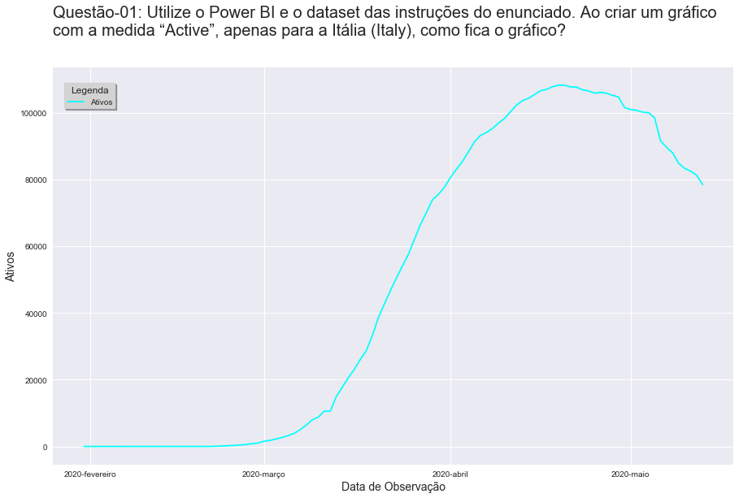

#### Pergunta 2
Considere o dataset gerado a partir das instruções do enunciado. Caso o algoritmo K-Means seja executado buscando apenas 1 cluster, qual será a coordenada do centroide ao final da execução? 

R:

As coordenadas do centroid para 1 cluster são: [0.02618523, -1.30384304]

#### Pergunta 3
Considere o dataset gerado a partir das instruções do enunciado. Qual o número ideal de clusters? 

R:

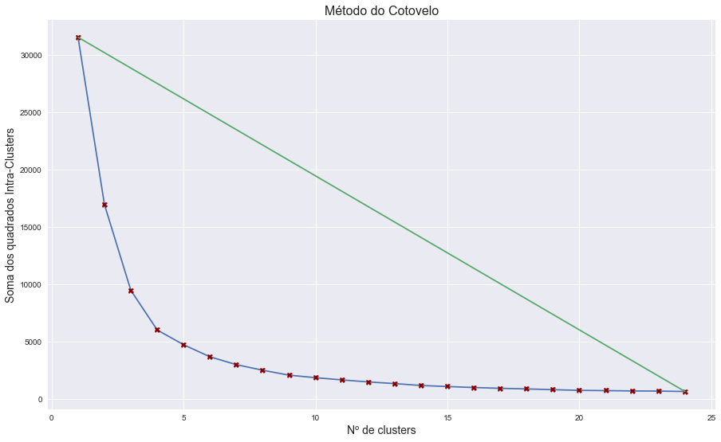

O número ideal de cluster obtido pelo Método do Cotovelo é: 5

#### Pergunta 4
Utilize o Power BI e o dataset das instruções do enunciado. Filtre por país, selecionando a Coreia do Sul (South Korea). Em que mês esse país atingiu o pico de casos ativos?

R:

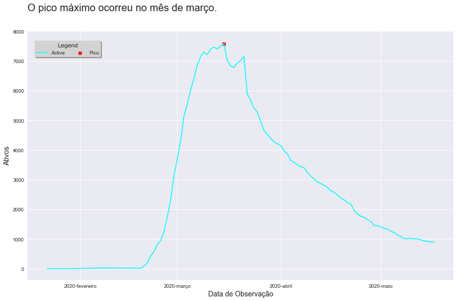

#### Pergunta 5
Utilize o Power BI e o dataset das instruções do enunciado. Filtre por país, selecionando a Itália (Italy). Analise as informações do dataset e responda: em que mês a Itália passou a ter mais casos recuperados do que casos ativos?

R:

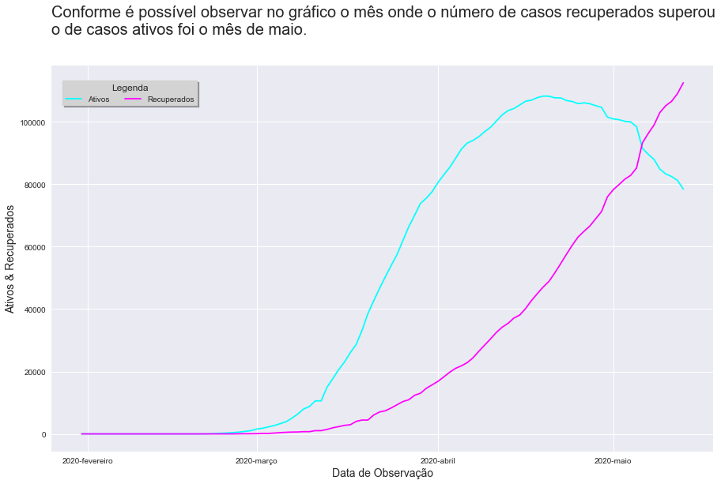

#### Pergunta 6
Considere o dataset gerado a partir das instruções do enunciado. Caso o algoritmo seja executado buscando apenas 1 cluster, qual será a soma dos quadrados intra-clusters (wcss) ao final da execução? 

R:

A soma dos quadrados intra-clusters é: 31547.372471390485

#### Pergunta 7
Considerando o dataset gerado a partir das instruções do enunciado, qual das imagens representa o gráfico correto? 

R:

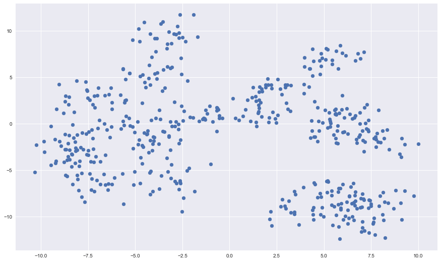

#### Pergunta 8
Considere o dataset gerado a partir das instruções do enunciado. Caso o algoritmo seja executado buscando 5 clusters, qual será a soma dos quadrados intra-clusters (wcss) ao final da execução? 

R:

A soma dos quadrados intra-clusters é: 4717.404091931214A soma dos quadrados intra-clusters é: 4717.404091931214

#### Pergunta 9
Utilize o Power BI e o dataset das instruções do enunciado. Ao criar um gráfico com as medidas “Confirmed”, “Deaths”, “Recovered” e “Active” apenas para a China (Mainland China), como fica o gráfico? 

R:

|    | ObservationDate     |   SNo |   Confirmed |   Deaths |   Recovered |   Active |
|---:|:--------------------|------:|------------:|---------:|------------:|---------:|
|  0 | 2020-01-22 00:00:00 |   535 |         547 |       17 |          28 |      502 |
|  1 | 2020-01-23 00:00:00 |  1713 |         639 |       18 |          30 |      591 |
|  2 | 2020-01-24 00:00:00 |  3004 |         916 |       26 |          36 |      854 |
|  3 | 2020-01-25 00:00:00 |  4224 |        1399 |       42 |          39 |     1318 |
|  4 | 2020-01-26 00:00:00 |  5548 |        2062 |       56 |          49 |     1957 |

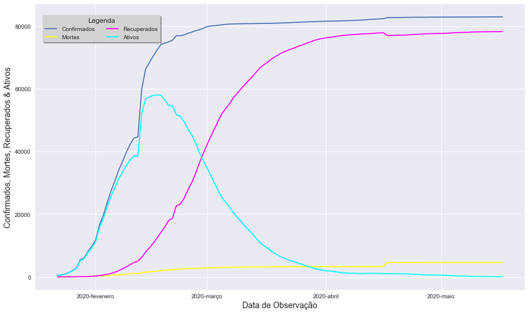

#### Pergunta 10
Qual o objetivo do algoritmo K-Means? 

R: Clusterização


#### Pergunta 11
O algoritmo K-Means é baseado em qual tipo de aprendizagem? 

R: Não supervisionada


#### Pergunta 12
Utilize o Power BI e o dataset das instruções do enunciado. Filtre por país, selecionando a Venezuela, analise as informações, perceba que algumas vezes o número de casos recuperados foi maior que o de casos ativos. Em que mês isso ocorreu pela primeira vez? 

R: 

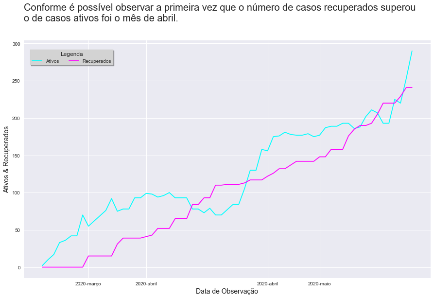

## Desafio do Módulo 1
### Objetivos
Exercitar os seguintes conceitos trabalhados no Módulo 1:
- Uso do Power BI
- SQL

### Enunciado
Para as questões de 1 a 7 instale o [Power BI Desktop](https://powerbi.microsoft.com/pt-br/downloads/), baixe o dataset [Stack Overflow Annual Developer Survey - 2019](https://insights.stackoverflow.com/survey) e carregue os dados no Power BI.

Realizar consultas em SQL é algo muito comum na rotina de um profissional que trabalha com dados. Então, nas questões de 8 a 15 vamos exercitar um pouco dessa habilidade. Para evitar a necessidade de instalar um servidor de banco de dados, acesse o site [SQL Online IDE](https://sqliteonline.com/), nós vamos utilizar o simulador do <b>PostgreSQL</b>. No anexo desse Trabalho Prático existe um script em SQL que deve ser executado (basta copiar, colar e clicar em “Run”) para criar as tabelas e popular o banco de dados.

O banco de dados gerado é baseado no livro “Sistemas de Banco de Dados” de Elmasri e Navathe, e tem o seguinte esquema:

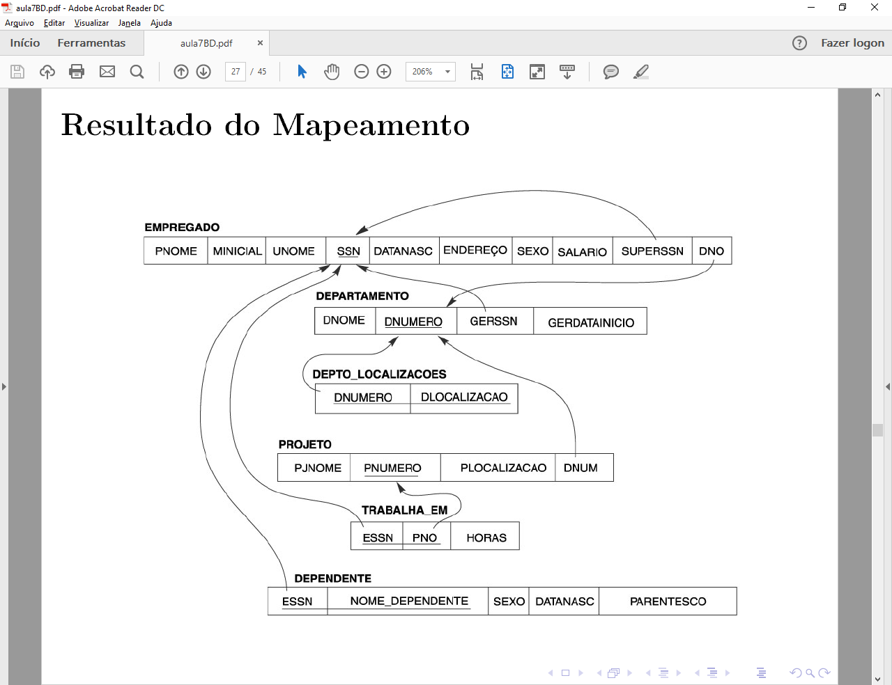

* [Notebook do Desafio 01](https://github.com/Collumbus/Bootcamp-Analista-de-Dados-IGTI/blob/master/Modulo-01/Desafio-01.ipynb)
##### OBS.: Neste repositório eu optei por utilizar o Jupyter Notebook e implementar as soluções das questões utilizando Python (Pandas, NumPy, psycopg2, Seaborn, etc) no lugar do Power BI e para realizar as consultas SQL.

#### Pergunta 1
Utilize o Power BI e o dataset das instruções do enunciado. Ao criar um gráfico de colunas com a média de salário (ConvertedComp) por formação (EdLevel), filtrando os dados do Brasil, como fica o gráfico?

R: 

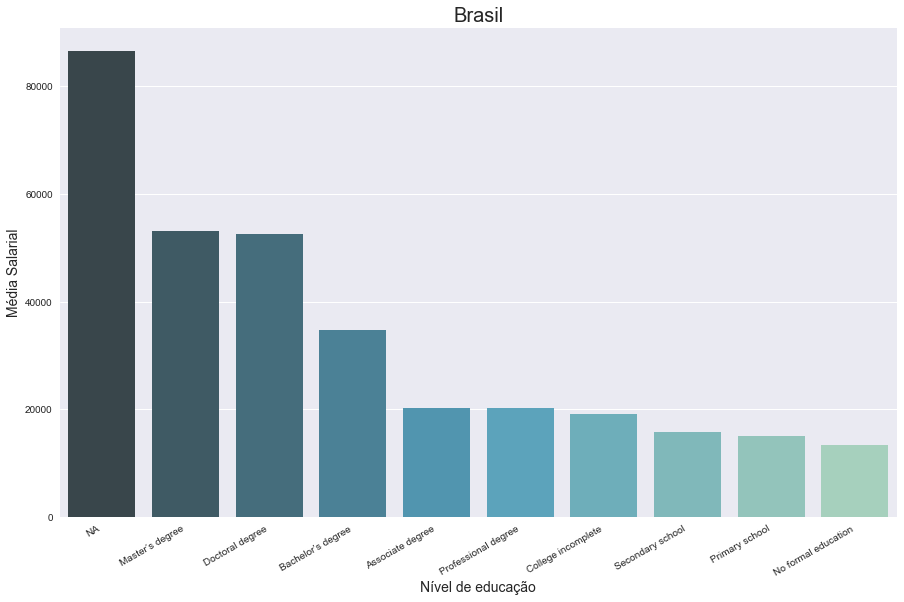

#### Pergunta 2
Utilize o Power BI e o dataset das instruções do enunciado. Crie um gráfico para analisar o uso de mídia sociais (SocialMedia) em cada país. Qual a mídia social mais usada nos Estados Unidos?

R: 

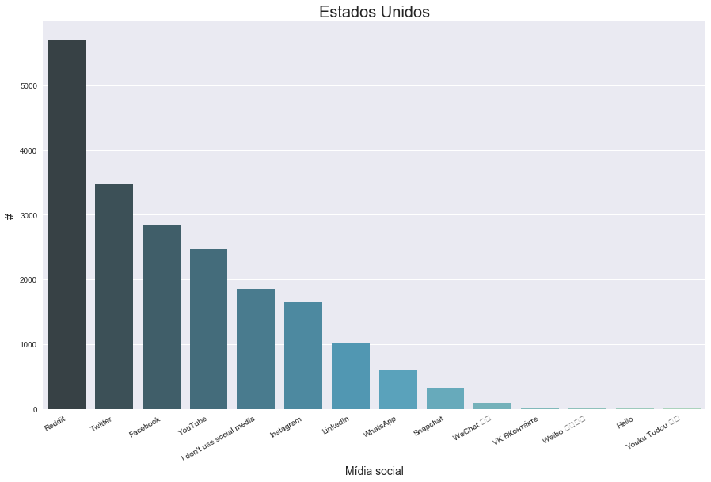

Conforme é possível observar pela consulta, a mídia social mais utilizada nos <b>Estados Unidos</b> é o <b>Reddit</b>.

#### Pergunta 3
Considere o banco de dados do enunciado. Crie uma consulta em SQL e responda: Quantos empregados do departamento 5 trabalham mais de 10h por semana no projeto chamado "ProductX"?

R: 
```
sql = '''
SELECT  pnome , unome, dnome, pjnome
FROM departamento, projeto, trabalha_em, empregado
WHERE dnumero = dnum AND
      pnumero = pno AND
      essn = ssn AND
      dnumero = 5 AND 
      horas > 10 AND 
      pjnome = 'ProductX'
'''
con=ConectionPostgre('localhost','IGTI','postgres','postgres123')
rs=con.consult(sql)
rs
print(f'O número de empregados do departamento 5 que trabalham mais de 10h por semana o projeto "ProductX" é: {len(rs)}')
```

O número de empregados do departamento 5 que trabalham mais de 10h por semana o projeto "ProductX" é: <b>2</b>.

#### Pergunta 4
Utilize o Power BI e o dataset das instruções do enunciado. Crie um gráfico para analisar o uso de mídia sociais (SocialMedia). Filtrando por quem tem 20 anos de experiência ou mais (YearsCode), qual a Mídia Social mais usada no mundo inteiro?

R: 

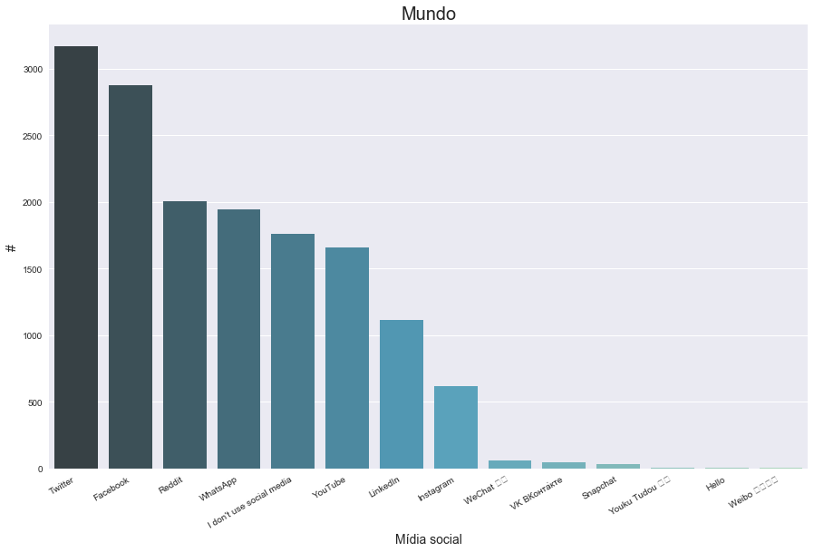

Conforme é possível observar pela consulta, a mídia social mais utilizada por quem possui 20 anos de experiência ou mais no mundo é o <b>Twitter</b>.

#### Pergunta 5
Considere o banco de dados do enunciado. Crie uma consulta em SQL e responda: Qual a média salarial nessa empresa?

R: 
```
sql = '''
SELECT  AVG(salario) AS MEDIA
FROM empregado
'''
con=ConectionPostgre('localhost','IGTI','postgres','postgres123')
rs=con.consult(sql)
print(f'A média salarial desta empresa é: R${float(rs[0][0])}.')
```

A média salarial desta empresa é: <b>R$35125.0</b>.

#### Pergunta 6
Considere o banco de dados do enunciado. Crie uma consulta em SQL e responda: Quantos empregados possuem um dependente com o mesmo primeiro nome que o deles?

R: 
```
sql = '''
SELECT  COUNT(ssn)
FROM empregado, dependente
WHERE ssn = essn AND
      pnome = nome_dependente
GROUP BY ssn
'''
con=ConectionPostgre('localhost','IGTI','postgres','postgres123')
rs=con.consult(sql)
rs
```

<b>Nenhum</b> empregado possui um dependente com o mesmo primeiro nome que seu.

#### Pergunta 7
Considere o banco de dados do enunciado. Crie uma consulta em SQL e responda: Qual é a soma dos salários de todos os empregados do departamento chamado 'Research'?

R: 
```
sql = '''
SELECT  SUM(salario) AS Soma
FROM empregado, departamento
WHERE dno = dnumero AND
      dnome = 'Research'
'''
con=ConectionPostgre('localhost','IGTI','postgres','postgres123')
rs=con.consult(sql)
print(f'A soma dos salarios dos empregados do departamento "Research" é: R${float(rs[0][0])}.')
```

A soma dos salarios dos empregados do departamento "Research" é: <b>R$133000.0</b>.

#### Pergunta 8
Utilize o Power BI e o dataset das instruções do enunciado. Ao criar um gráfico de colunas com a média de salário (ConvertedComp) por nível de satisfação (CareerSat), filtrando os dados do Chile, como fica o gráfico?

R: 

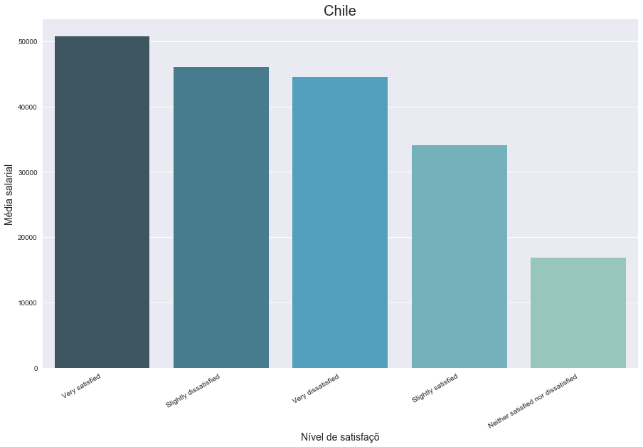

#### Pergunta 9
Considere o banco de dados do enunciado. Crie uma consulta em SQL e responda: Qual seria o custo do projeto com folha salarial (soma de todos os salários), caso a empresa desse 10% de aumento para todos os empregados que trabalham no projeto 'ProductX'?

R: 
```
sql = '''
SELECT  SUM(salario) * 1.1 AS Soma
FROM empregado, trabalha_em, projeto
WHERE ssn = essn AND
      pno = pnumero AND
      pjnome = 'ProductX'
'''
con=ConectionPostgre('localhost','IGTI','postgres','postgres123')
rs=con.consult(sql)
print(f'A soma dos salarios dos empredados do departamento "Research" é: R${float(rs[0][0])}.')
```
A soma dos salarios dos empredados do departamento "Research" é: <b>R$60500.0</b>.

#### Pergunta 10
Considere o banco de dados do enunciado. Crie uma consulta em SQL e responda: Quem é a pessoa que possui mais tempo de alocação no projeto 'Newbenefits'?

R: 
```
sql = '''
SELECT  pnome, horas
FROM empregado, trabalha_em, projeto
WHERE ssn = essn AND
      pno = pnumero AND
      pjnome = 'Newbenefits' 
ORDER BY horas DESC
'''
con=ConectionPostgre('localhost','IGTI','postgres','postgres123')
rs=con.consult(sql)
print(f'A pessoa que possui mais tempo de alocação no projeto "Newbenefits" é a {rs[0][0]} com {rs[0][1]} horas alocadas.')
```
A pessoa que possui mais tempo de alocação no projeto "Newbenefits" é a <b>Alicia</b> com 30.0 horas alocadas.

#### Pergunta 11
Considere o banco de dados do enunciado. Crie uma consulta em SQL e responda: Quais os nomes de todos os empregados que são diretamente supervisionados por Franklin Wong?

R: 
```
sql = '''
SELECT  em.pnome
FROM empregado AS em, empregado AS sp
WHERE em.superssn = sp.ssn AND
      sp.pnome = 'Franklin' AND
      sp.unome = 'Wong'
'''
con=ConectionPostgre('localhost','IGTI','postgres','postgres123')
rs=con.consult(sql)
print(f'Os empregados que são diretamente supervisionados por Franklin Wong são {rs[0][0]} e {rs[1][0]}.')
```
Os empregados que são diretamente supervisionados por Franklin Wong <b>Joyce</b> e <b>Ramesh</b>.

#### Pergunta 12
Utilize o Power BI e o dataset das instruções do enunciado. Crie um gráfico para analisar o uso de mídia sociais (SocialMedia) em cada país. Qual a mídia social mais usada no Brasil?

R: 

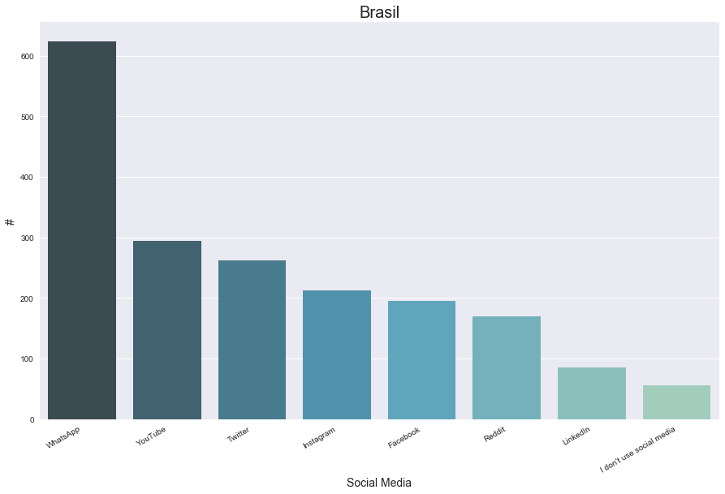

Conforme é possível observar pela consulta, a mídia social mais utilizada nos Brasil é o <b>WhatsApp</b>.

#### Pergunta 13
Questão-13: Utilize o Power BI e o dataset das instruções do enunciado. Crie um gráfico de dispersão com o tempo de experiência (YearsCode) e o salário (ConvertedComp). Crie um filtro para exibir os registros de quem possui mais que 5 anos e menos que 30 anos de experiência. Como fica o gráfico?
### <span style="color:red">QUESTÃO ANULADA</span>

#### Pergunta 14
Utilize o Power BI e o dataset das instruções do enunciado. Crie um gráfico para analisar o nível de formação dos desenvolvedores (EdLevel). Aplicando um filtro que remove apenas os registros dos Estados Unidos, qual é o país com maior número de desenvolvedores que nunca tiveram uma educação formal?

R: 

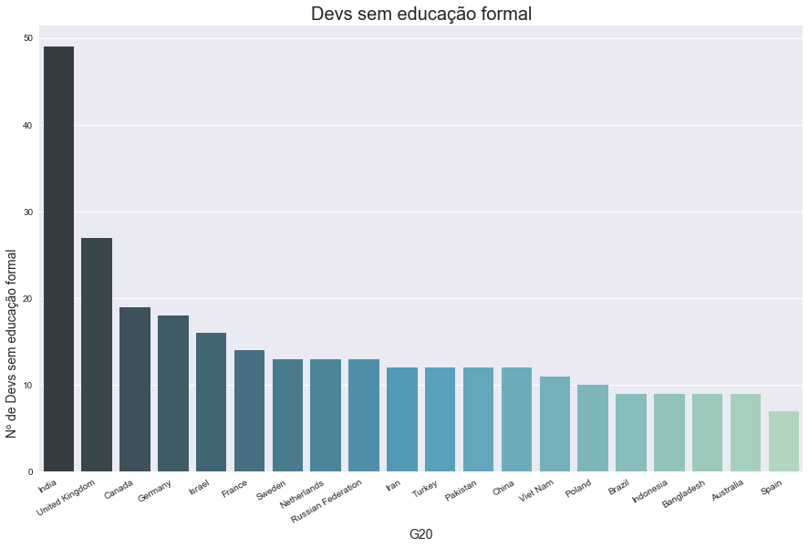

O país com maior número de desenvolvedores que nunca tiveram uma educação formal é a <b>Índia</b>.

#### Pergunta 15
Considere o banco de dados do enunciado. Crie uma consulta em SQL e responda: Qual o nome do departamento com a menor média de salário entre seus funcionários?

R: 
```
sql = '''
SELECT  dnome, AVG(salario) AS Média
FROM departamento, projeto, trabalha_em, empregado
WHERE dnumero = dnum AND
      pnumero = pno AND
      essn = ssn
GROUP By dnome
ORDER BY Média ASC
'''
con=ConectionPostgre('localhost','IGTI','postgres','postgres123')
rs=con.consult(sql)
print(f'O departamento com a menor média de salário entre seus funcionários e o "{rs[0][0]}"'
      f' com a média salarial de R${rs[0][1]:.2f}.'
```

O departamento com a menor média de salário entre seus funcionários e o "Administration" com a média salarial de <b>R$30500.00</b>.